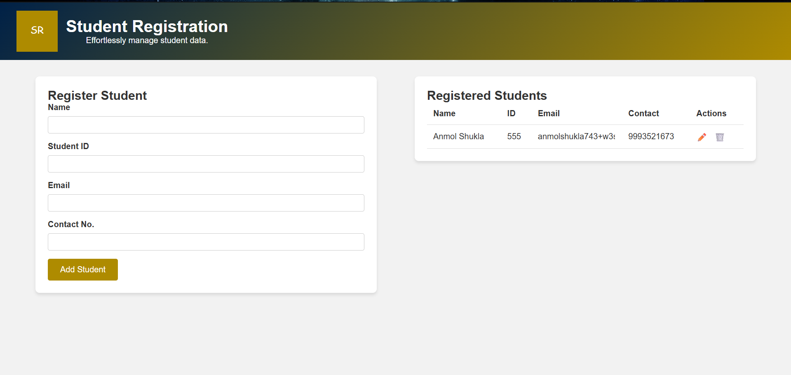

# Student Registration System

## Description

The Student Registration System is a web application designed to easily manage student data. It provides functionality to register new students, view registered students, edit their details, and delete records efficiently.

## Features

- Add new student with name, student ID, email, and contact number.
- Display all registered students in a responsive table.
- Edit and delete student records.
- Data persistence using browser localStorage.

## Technologies Used

- HTML5
- CSS3
- JavaScript

## How to Use

1. Open the `index.html` file in a modern web browser.
2. Fill the registration form with student details.
3. Click the "Add Student" button to register.
4. View the registered students in the table below.
5. Use the Edit or Delete buttons to update or remove student records.

## Project Structure

- `index.html` – Main HTML page.
- `css/style.css` – Stylesheet for the application.
- `js/script.js` – JavaScript functionality.
- `assets/logo.svg` – Logo image displayed on the page.

## License

This project is licensed under the MIT License.
